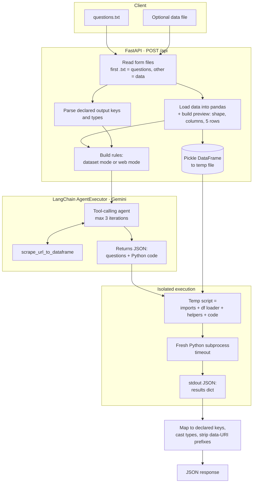

# Data Analyst Agent

An API that answers plain-English questions about your data. A Gemini-powered agent writes pandas code, the server runs it in a separate process, and you get typed JSON answers and charts back.

**Demo:** [walkthrough](DEMO_LINK_HERE)

> **In one line:** send a `questions.txt` and, optionally, a CSV, Excel, JSON or Parquet file (or point the agent at a web page) → get back a JSON object with one computed answer per question, including base64 charts under 100 KB.

---

## Table of contents

1. [Why this exists](#why-this-exists)
2. [Features](#features)
3. [Architecture](#architecture)
4. [Request lifecycle](#request-lifecycle)
5. [Project structure](#project-structure)
6. [Tech stack](#tech-stack)
7. [Getting started](#getting-started)
8. [Configuration](#configuration)
9. [API reference](#api-reference)
10. [Writing a questions file](#writing-a-questions-file)
11. [Error handling](#error-handling)
12. [Design decisions](#design-decisions)
13. [Security notes](#security-notes)
14. [Known limitations](#known-limitations)
15. [Roadmap](#roadmap)

---

## Why this exists

Asking an LLM to "analyze this CSV" usually goes wrong in two ways: the data doesn't fit in the prompt, and the model does arithmetic in its head, so the numbers look right but aren't. Analysts want answers they can trust and reproduce.

This agent changes the model's job. **It doesn't compute answers. It writes the code that computes them.** The code runs against the real data in pandas, so every number can be traced back to a line of Python.

---

## Features

- **Natural-language questions** in a plain `.txt` file, as many as you like per request.
- **Many input formats:** CSV, Excel (`.xls`/`.xlsx`), JSON, Parquet, and images (PNG/JPG, loaded with Pillow).
- **Web data on demand:** with no file uploaded, the agent can call a scraping tool that turns a URL into a DataFrame. It handles HTML tables, CSV, Excel, Parquet and JSON endpoints, and falls back to page text.
- **LangChain tool-calling agent** on Gemini (default `gemini-2.5-pro`, configurable).
- **Code runs out-of-process** in a fresh Python subprocess with the DataFrame injected and a timeout.
- **Charts included:** a built-in `plot_to_base64()` helper returns Matplotlib figures as base64 images, shrinking them until they fit under 100 KB.
- **Typed, named output:** declare keys and types (`number`, `integer`, `string`) in the questions file, and answers are mapped and cast to match.
- **Retries and timeouts:** up to 3 agent attempts, plus an overall request timeout.
- **Web UI** at `/` and a **Dockerfile** for deployment.

---

## Architecture



---

## Request lifecycle

1. **Collect files.** The first `.txt` file in the form is treated as the questions; any other file is the dataset.
2. **Parse the output contract.** Lines like `` - `total_revenue`: number `` are extracted with a regex to build an ordered key list and a type map.
3. **Load the data.** The file is read into a DataFrame based on its extension. A preview (row and column counts, column names, and the first 5 rows as a Markdown table) is added to the prompt, so the model sees the real schema without receiving the whole dataset.
4. **Choose the rules.**
   - *Dataset mode:* the agent must use the provided `df`/`data`, and is told **not** to scrape.
   - *Web mode:* the agent is told to call `scrape_url_to_dataframe(url)` when it needs data.
5. **Run the agent.** A LangChain `create_tool_calling_agent` + `AgentExecutor` (max 3 iterations, parsing errors handled) must return **only** a JSON object:
   ```json
   {
     "questions": ["What was total revenue?", "..."],
     "code": "results['What was total revenue?'] = float(df['revenue'].sum())\n..."
   }
   ```
   If the agent returns nothing, it's retried up to 3 times.
6. **Extract JSON robustly.** Code fences are stripped, and the outermost `{ ... }` is located. If parsing fails, progressively shorter candidates are tried before giving up with the raw text attached.
7. **Pre-fetch web data.** In web mode, the code is scanned for `scrape_url_to_dataframe("...")` calls. The first URL is fetched by the server, and the result is pickled so the generated code receives it as `df`.
8. **Execute.** A temporary script is assembled from:
   - imports (`pandas`, `numpy`, `matplotlib` with the `Agg` backend, `base64`, Pillow if available);
   - `df = pd.read_pickle(...)` and `data = df.to_dict("records")`;
   - the `plot_to_base64()` helper and a fallback scraper;
   - `results = {}` and the generated code;
   - a final `print(json.dumps({"status": "success", "result": results}))`.

   It runs with `subprocess.run([sys.executable, script], timeout=...)`. Temp files are deleted afterwards.
9. **Shape the response.** Answers are keyed by the original question strings (missing ones become `"Answer not found"`). If output keys were declared, answers are mapped to them in order and cast, and `data:image/...;base64,` prefixes are stripped from images.

---

## Project structure

```text
data-analyst-agent/
├── app.py             # FastAPI app, scraping tool, agent setup, code runner, /api route
├── index.html         # Web UI
├── requirements.txt
├── Dockerfile         # python:3.12-slim image
├── entrypoint.sh      # container start script
├── Procfile           # process definition for Heroku/Railway-style hosts
├── runtime.txt        # Python version pin for buildpacks
└── LICENSE
```

---

## Tech stack

| Concern | Technology |
| --- | --- |
| API | **FastAPI**, Uvicorn |
| Agent orchestration | **LangChain** (`create_tool_calling_agent`, `AgentExecutor`) |
| LLM | **Google Gemini** via `langchain-google-genai` |
| Data | **pandas**, NumPy, PyArrow (Parquet), openpyxl (Excel), DuckDB |
| Scraping | requests, **BeautifulSoup**, lxml, html5lib, `pandas.read_html` |
| Charts | **Matplotlib**, Seaborn, Pillow (WebP compression) |
| Graphs | NetworkX (available to generated code) |
| Deployment | **Docker**, Procfile-based hosts |

---

## Getting started

### Prerequisites

- Python 3.10+ (the Docker image uses 3.12)
- A **Google AI Studio API key** for Gemini

### Run locally

```bash
git clone https://github.com/Riddhim-r/data-analyst-agent.git
cd data-analyst-agent
python -m venv venv && source venv/bin/activate     # Windows: venv\Scripts\activate
pip install -r requirements.txt

cat > .env <<'EOF'
GOOGLE_API_KEY=your_google_api_key
EOF

python app.py
```

The server starts on **http://localhost:8000** (or `$PORT` if set). Open it in a browser for the web UI.

### Run with Docker

```bash
docker build -t data-analyst-agent .
docker run -p 8000:8000 --env-file .env data-analyst-agent
```

---

## Configuration

| Variable | Default | Purpose |
| --- | --- | --- |
| `GOOGLE_API_KEY` | — (required) | Gemini API key |
| `GOOGLE_MODEL` | `gemini-2.5-pro` | Gemini model used by the agent |
| `LLM_TIMEOUT_SECONDS` | `150` | Timeout for the agent, the code subprocess, and the whole request |
| `PORT` | `8000` | Server port when started with `python app.py` |

---

## API reference

### `POST /api`

`multipart/form-data` with:

| Part | Required | Accepted types |
| --- | --- | --- |
| Questions file | ✅ | `.txt` (the first `.txt` in the form) |
| Data file | — | `.csv`, `.xlsx`, `.xls`, `.json`, `.parquet`, `.png`, `.jpg`, `.jpeg` |

Field names don't matter; files are identified by extension.

```bash
curl -X POST http://localhost:8000/api \
  -F "questions_file=@questions.txt" \
  -F "data_file=@sales.csv"
```

**Response `200`, without declared keys** (keyed by question text):

```json
{
  "What was total revenue?": 1284500.0,
  "Which region had the highest growth?": "South",
  "Plot monthly revenue as a line chart.": "iVBORw0KGgoAAAANSUhEUgAA..."
}
```

**Response `200`, with declared keys** (see below):

```json
{
  "total_revenue": 1284500.0,
  "top_region": "South",
  "revenue_chart": "iVBORw0KGgoAAAANSUhEUgAA..."
}
```

### `GET /api`

Health and info check: `{"ok": true, "message": "Server is running. ..."}`.

### `GET /`

Serves the web UI.

---

## Writing a questions file

Write questions one per line. To get named, typed fields back, add a key list in this format:

```text
Analyze the attached sales data.

1. What was total revenue?
2. Which region had the highest growth?
3. Plot monthly revenue as a line chart.

Return a JSON object with keys:
- `total_revenue`: number
- `top_region`: string
- `revenue_chart`: string
```

- Supported types: `number` / `float` → float, `integer` / `int` → int, `string` → str. Anything else is treated as a string.
- Keys are matched to answers **in order**.
- For charts, ask for a plot. The generated code uses `plot_to_base64()`, which tries PNG at 100 → 80 → 60 → 50 → 40 → 30 DPI, then WebP at quality 80 and 60, to get under 100 KB.

**Web-data example** (no data file attached):

```text
Scrape the list of highest-grossing films from Wikipedia.

1. How many films grossed over $2 billion?
2. Which film is the earliest to gross over $1.5 billion?
3. Draw a scatterplot of Rank vs Peak with a dotted red regression line.
```

---

## Error handling

| Status | When |
| --- | --- |
| `400` | No `.txt` questions file, unsupported data file type, or an image that can't be processed |
| `408` | The whole request exceeded `LLM_TIMEOUT_SECONDS` |
| `500` | The agent returned nothing after 3 attempts, the JSON couldn't be parsed, scraping failed, or the generated code raised an error (its stderr is included in `detail`) |

---

## Design decisions

**1. The LLM writes code; it doesn't compute.**
Numbers come from pandas running on the actual data, not the model's arithmetic. Answers are reproducible, auditable, and work on datasets far larger than any prompt.

**2. Show the model the schema, not the data.**
The prompt gets shape, column names and 5 sample rows. That's enough to write correct code while keeping token cost flat regardless of dataset size.

**3. Separate modes for uploaded data and web data.**
When a file is uploaded, the agent is explicitly told not to scrape, which stops it from wandering off to the internet when the answer is in the file. Without a file, scraping is the expected path.

**4. Run generated code out-of-process.**
Model-written code runs in a fresh Python interpreter with a timeout. A crash, infinite loop or memory blow-up in generated code kills that process, not the API server.

**5. Fetch the data once, on the server.**
The server performs the scrape and injects the result as a pickle, so the generated code always receives a ready DataFrame (`df`) instead of making its own network calls.

**6. Enforce an output contract.**
Graders, dashboards and other programs need predictable keys and types. Declared keys plus type casting turn free-form answers into a stable API response.

**7. Bound everything.**
Agent iterations (3), agent retries (3), the subprocess timeout and the overall request timeout keep a single bad request from tying up the server.

---

## Security notes

The subprocess provides **isolation from crashes, not a security sandbox**. Generated code can still read files and make network calls with the server's permissions. Before exposing this to untrusted users, run execution inside a locked-down container (no network, read-only filesystem, CPU and memory limits) or a dedicated sandbox service.

---

## Known limitations

- Only the **first** scraped URL in the generated code is pre-fetched.
- Only **one** data file per request.
- Key mapping is positional, so the questions and declared keys must be in the same order.
- The scraper takes the **first** HTML table on a page; pages with several tables may need a more specific URL.
- The agent runs synchronously in a thread; high concurrency would need a task queue.

---

## Roadmap

- [ ] Sandboxed execution (container per job, or a remote code-execution service).
- [ ] Multiple data files and multiple scraped sources per request.
- [ ] Return the generated code with each answer for transparency.
- [ ] Self-correction loop: feed execution errors back to the agent for one fix attempt.
- [ ] Support other LLM providers through LangChain's model interface.

---

## License

MIT, see [LICENSE](LICENSE).

## Author

**Riddhim Rathor** · [LinkedIn](https://linkedin.com/in/riddhim-rathor) · [Portfolio](https://riddhim-spotted-on.vercel.app/) · [GitHub](https://github.com/Riddhim-r)
